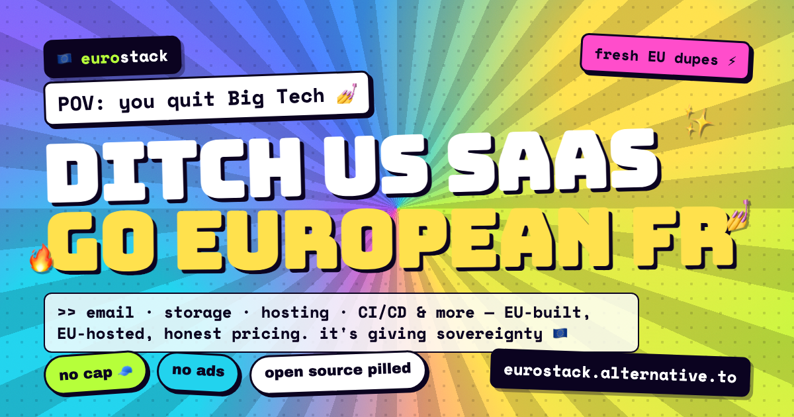

<!-- HEADER -->
<div align="center">
  
  <br><br>
</div>

European alternatives to the US SaaS and cloud tools most teams reach for by
default. Sorted by category, with where each one is hosted and what it costs.
Kept current, PRs welcome.

Live at **https://eurostack.alternative.to**.

## How it works

The catalog is **data-driven**. You don't edit HTML — you edit data.

```
data/            source of truth: one YAML file per category
scripts/verify   validates the data (schema, dead links, duplicates)
scripts/build    renders data/ -> dist/
dist/            generated site (built in CI, not committed)
```

## Contributing

1. Add or edit a tool in the relevant `data/*.yml` file.
2. Open a pull request.
3. On push, the **verify-data** pipeline checks your data automatically.
4. A maintainer reviews, then manually runs **build & publish** to ship it.

Nothing goes live automatically — every publish is a deliberate, reviewed step.

## What we optimise for

- **Honest, first-hand notes** — where a tool is hosted, what it costs, the
  trade-offs. No affiliate links, no ranking-for-pay.
- **Primary sources** — we link official sites and pricing pages, not other
  alternative directories.
